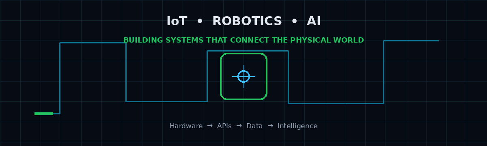
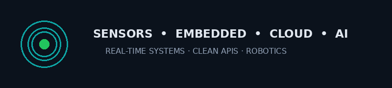
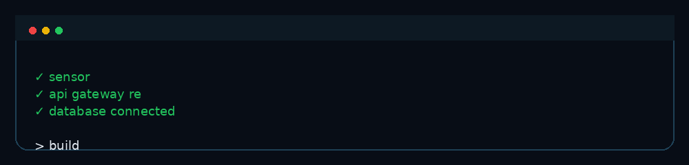
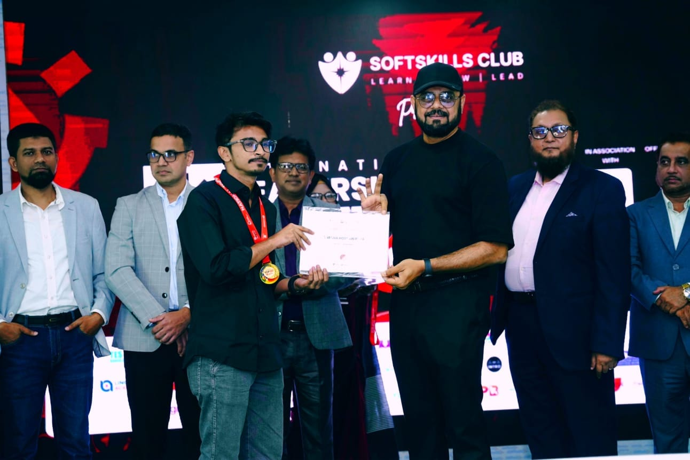
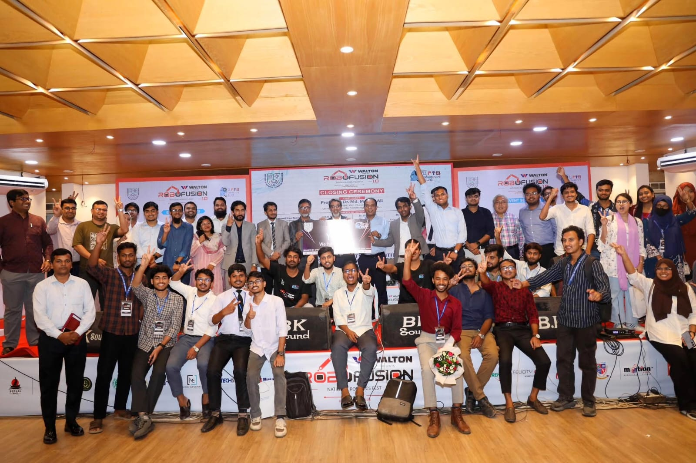
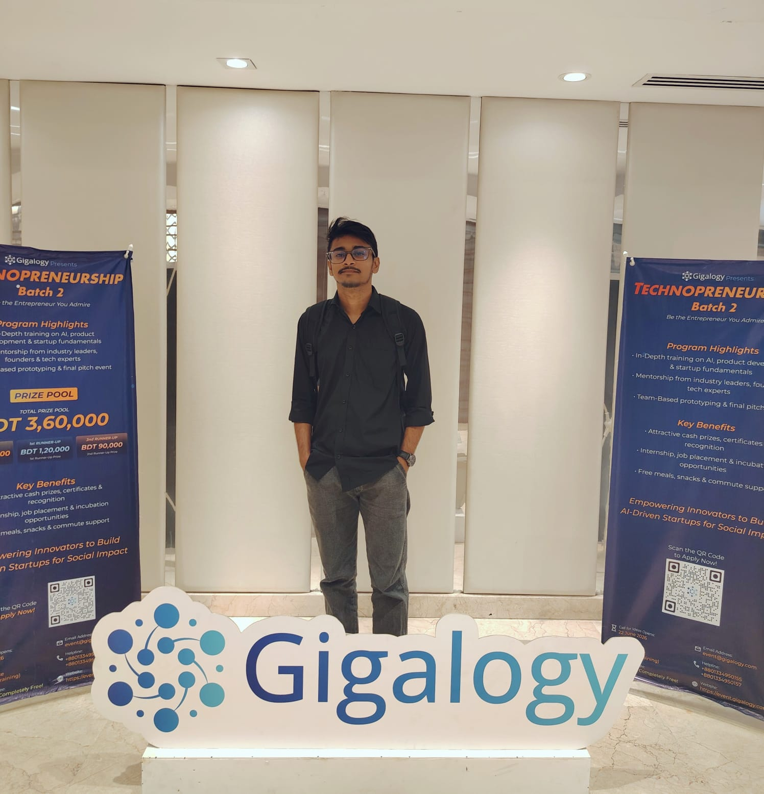
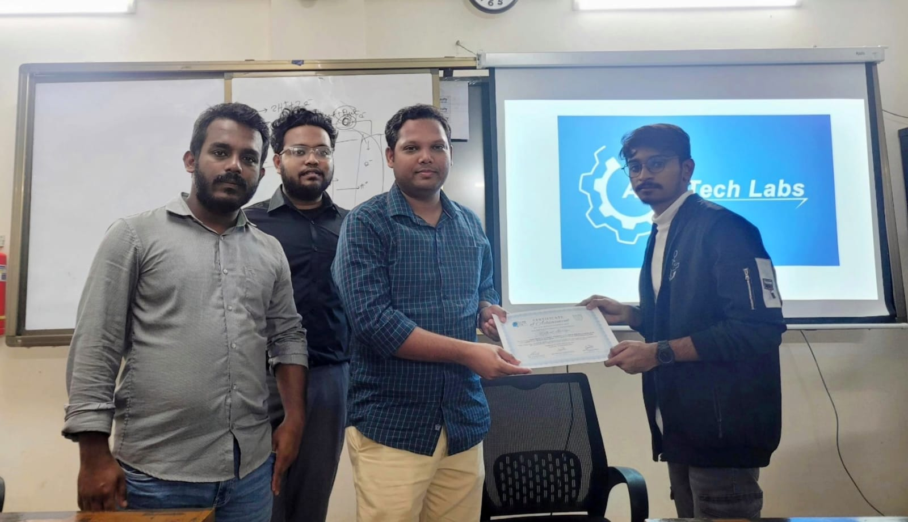

<div align="center">



<h1>Md. Rafiul Islam</h1>

<h3>IoT & Robotics Engineering Undergraduate · Backend & AI Builder</h3>

<p>
  <a href="https://portfolio-website-rafiul.vercel.app">Portfolio</a> ·
  <a href="https://www.linkedin.com/in/rafiul-islam-25sep92004">LinkedIn</a> ·
  <a href="https://youtube.com/@pintocloud">YouTube</a> ·
  <a href="https://medium.com/@rafiulislam25">Medium</a> ·
  <a href="https://github.com/rafiul254">GitHub</a>
</p>


</div>

<br/>

## 👋 About Me

I'm **Md. Rafiul Islam**, an **IoT & Robotics Engineering undergraduate** who enjoys building systems where **hardware, software, backend services, and AI** work together.

My focus is not only on making a prototype work. I also care about the engineering behind it: **clean architecture, scalable APIs, reliable data flow, maintainable code, and useful user experiences**.

### What I enjoy building

- 🔌 **IoT & Robotics** — ESP32, Arduino, sensors, RFID, GPS, automation and embedded systems
- ⚙️ **Backend Engineering** — REST APIs, modular services, database-driven applications and clean architecture
- 🧠 **AI / ML / Computer Vision** — practical machine learning, image processing and AI-powered applications
- 💻 **Problem Solving** — competitive programming, algorithms and core programming fundamentals
- 🎬 **Creative Work** — video editing, photography, books and travelling

> **My direction:** connect the physical world to intelligent software — from sensor to API, from API to data, and from data to decisions.

---

<div align="center">

</div>

<br/>

## 🧩 Engineering Focus

<table width="100%">
<tr>
<td width="33%" align="center" valign="top">

<h3>🔌 IoT & Robotics</h3>

Embedded systems<br/>
Sensors & actuators<br/>
ESP32 / Arduino<br/>
RFID / GPS / Serial<br/>
Automation & control

</td>

<td width="33%" align="center" valign="top">

<h3>⚙️ Backend Engineering</h3>

REST APIs<br/>
Scalable services<br/>
Clean architecture<br/>
Database design<br/>
Real-time systems

</td>

<td width="33%" align="center" valign="top">

<h3>🧠 AI & Data</h3>

Machine Learning<br/>
Computer Vision<br/>
Data analysis<br/>
LLM integration<br/>
Intelligent automation

</td>
</tr>
</table>

---

## 🛠️ Tech Stack

### 💻 Languages & Competitive Programming

<p align="center">


</p>

### ⚙️ Backend, APIs & Architecture

<p align="center">


</p>

### 🌐 Frontend

<p align="center">


</p>

### 🤖 AI / ML / Computer Vision

<p align="center">


</p>

### 🔌 Embedded, IoT & Robotics

<p align="center">


</p>

### 🗄️ Databases & Tools

<p align="center">


</p>

---

<div align="center">

</div>

## 📊 GitHub Stats

<div align="center">


<br/><br/>


</div>

---

## 🏆 Honors & Accomplishments

<div align="center">

<table width="100%">
<tr>
<td width="50%" align="center">


<h3>🏅 ICT Olympiad Bangladesh</h3>
<p><b>Engineering Track · National Semi-Finalist</b></p>

</td>
<td width="50%" align="center">



<h3>🏆 ILC 1.0</h3>
<p><b>National Top 100 Winner</b></p>

</td>
</tr>

<tr>
<td width="50%" align="center">



<h3>🤖 RoboFusion 1.0</h3>
<p><b>Multi-Hazard Smart Campus Safety System</b></p>

</td>
<td width="50%" align="center">



<h3>🚀 Gigalogy Technopreneurship</h3>
<p><b>Batch 2 · AI & Startup Building</b></p>

</td>
</tr>

<tr>
<td colspan="2" align="center">



<h3>🥉 IoT & Robotics Contest — 3rd Place</h3>
<p><b>University of Frontier Technology Bangladesh</b></p>

</td>
</tr>
</table>

</div>

---

## 🚀 Featured Projects

<table width="100%">
<tr>
<td width="50%" valign="top">

<h3>🛡️ RoboFusion 1.0</h3>

<b>Multi-Hazard Smart Campus Safety System</b>

<p>
A connected safety platform combining IoT sensing, backend services,
database storage and a real-time dashboard.
</p>

<b>Stack:</b> ESP32 · Node.js · Express · TypeScript · SQLite · React

<br/><br/>

<a href="https://github.com/rafiul254">

</a>

</td>

<td width="50%" valign="top">

<h3>⌨️ AI Banglish Keyboard</h3>

<b>Banglish → বাংলা / English AI Converter</b>

<p>
An AI-assisted text conversion tool focused on practical language processing
and cross-platform use.
</p>

<b>Stack:</b> Python · Kotlin · Groq API · Llama

<br/><br/>

<a href="https://github.com/rafiul254">

</a>

</td>
</tr>

<tr>
<td width="50%" valign="top">

<h3>🎬 CineMatch AI</h3>

<b>AI Movie Recommendation Engine</b>

<p>
A recommendation system combining content-based features, Bayesian signals,
popularity and analytics for personalized discovery.
</p>

<b>Stack:</b> Python · scikit-learn · Hugging Face

<br/><br/>

<a href="https://github.com/rafiul254/Cinemach-Ai">

</a>
<a href="https://huggingface.co/spaces/Rafi-ul/cinematch-ai">

</a>

</td>

<td width="50%" valign="top">

<h3>🌱 Grow & Bloom</h3>

<b>Hand-Gesture Computer Vision App</b>

<p>
An interactive web experience using real-time hand gesture recognition
for visual interaction.
</p>

<b>Stack:</b> JavaScript · OpenCV · MediaPipe

<br/><br/>

<a href="https://rafiul254.github.io/Grow-and-Bloom/">

</a>

</td>
</tr>

<tr>
<td width="50%" valign="top">

<h3>🔐 RFID Access Control</h3>

<b>IoT Security & Monitoring System</b>

<p>
An RFID-based access-control concept connecting embedded hardware,
authentication, Firebase and a web dashboard.
</p>

<b>Stack:</b> ESP32 · RFID · Firebase · React

</td>

<td width="50%" valign="top">

<h3>🔩 OopsStopper Robot</h3>

<b>Autonomous Edge-Detection Safety Robot</b>

<p>
A compact robot using an IR sensor array and motor control to detect edges
and prevent falls.
</p>

<b>Stack:</b> Arduino · C++ · IR Sensors · L298N

<br/><br/>

<a href="https://youtube.com/shorts/E52RMUhqKQ4">

</a>

</td>
</tr>
</table>

---

## 🏗️ How I Think About Systems

<div align="center">

```text
┌──────────────┐
│    Sensors   │
│ ESP32 / MCU  │
└──────┬───────┘
       │
       ▼
┌──────────────┐
│ Embedded App │
│ Control Logic│
└──────┬───────┘
       │
       ▼
┌──────────────┐
│ APIs / Data  │
│ REST / MQTT  │
└──────┬───────┘
       │
       ▼
┌──────────────┐
│ Backend      │
│ Services     │
└──────┬───────┘
       │
       ▼
┌──────────────┐
│ AI / ML / CV │
│ Intelligence │
└──────┬───────┘
       │
       ▼
┌──────────────┐
│ Product / UI │
│ Web / Mobile │
└──────────────┘
```

</div>

---

## 🌍 Beyond Engineering

I like keeping engineering connected to the real world.

- ✈️ **Travel** — discovering new places and perspectives
- 📚 **Books** — learning outside the syllabus
- 🎬 **Video Editing** — turning raw footage into stories
- 📷 **Photography** — documenting moments
- 🧩 **Problem Solving** — competitive programming and algorithmic thinking

---

## 🔗 Quick Links

<div align="center">

<a href="https://portfolio-website-rafiul.vercel.app">

</a>
<a href="https://www.linkedin.com/in/rafiul-islam-25sep92004">

</a>
<a href="https://youtube.com/@pintocloud">

</a>
<a href="mailto:rafuulislam2004@gmail.com">

</a>

<br/><br/>


<h3>⚡ Build · Connect · Automate · Learn</h3>

<p>
<b>IoT & Robotics Engineer in progress — building systems that connect the physical world with intelligent software.</b>
</p>

</div>
